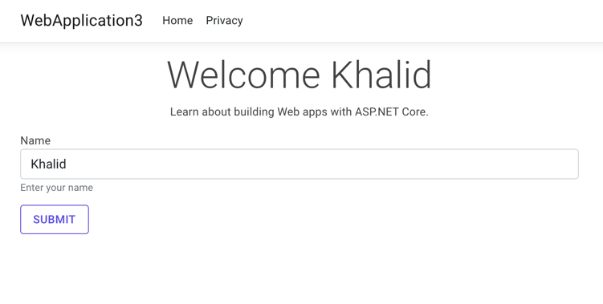

## Using MudBlazor in Razor Pages

This repository uses [MudBlazor](https://www.mudblazor.com/), a Blazor UI framework, within a Razor Pages context. I don't recommend this approach, but folks might want the same styling as the rest of their Blazor application on their server-rendered pages.

So here it is. Let's follow the steps.

## Step 1. Install MudBlazor

Install the NuGet Package of `MudBlazor` and update your `Program.cs` with the following.

```csharp
builder.Services.AddServerSideBlazor();
builder.Services.AddMudServices();
```

and 

```csharp
app.UseHttpsRedirection();
app.UseStaticFiles();
app.UseRouting();
app.UseAuthorization();
app.MapRazorPages();
// add the hub (you won't actually use it, but it's necessary)
app.MapBlazorHub();
app.Run();
```

## Step 2. Update _Layout.cshtml

You'll need all the MudBlazor stuff in your `_Layout.cshtml`. It will look like the following.

```html
<head>
    <meta charset="utf-8"/>
    <meta name="viewport" content="width=device-width, initial-scale=1.0"/>
    <title>@ViewData["Title"] - WebApplication3</title>
    <link rel="stylesheet" href="~/lib/bootstrap/dist/css/bootstrap.min.css"/>
    <link rel="stylesheet" href="~/css/site.css" asp-append-version="true"/>
    <link href="https://fonts.googleapis.com/css?family=Roboto:300,400,500,700&display=swap" rel="stylesheet" />
    <link href="_content/MudBlazor/MudBlazor.min.css" rel="stylesheet" />
    <script defer src="_content/MudBlazor/MudBlazor.min.js"></script>
    <link rel="stylesheet" href="~/WebApplication3.styles.css" asp-append-version="true"/>
    @(await Html.RenderComponentAsync<MudThemeProvider>(RenderMode.Static))
</head>
```

Cool...

## Step 3. _Imports.razor

This is just necessary for all `.razor files`. You can skip this if you only have one component and just include the namespaces in the one file. Up to you.

```csharp
@using System.Net.Http
@using Microsoft.AspNetCore.Components.Forms
@using Microsoft.AspNetCore.Components.Routing
@using Microsoft.JSInterop
@using Microsoft.AspNetCore.Components.Web
@using MudBlazor
```

## Step 4. Create a Razor Wrapper

This step is not entirely necessary in some cases, but I find it's easier to logic and code using MudBlazor when it's within a `.razor` file.

Create a new file called `Button.razor` in the Pages directory.

```html
<MudButton ButtonType="ButtonType.Submit" Color="Color.Primary" Variant="Variant.Outlined">
    Submit
</MudButton>
```

## Step 5. Create an ASP.NET Core Form

In the `Index.cshtml` file, I've created a basic HTML form.

```html
@page
@model IndexModel
@{
    ViewData["Title"] = "Home page";
}

<div class="text-center">
    <h1 class="display-4">Welcome @Model.Name</h1>
    <p>Learn about <a href="https://docs.microsoft.com/aspnet/core">building Web apps with ASP.NET Core</a>.</p>
</div>

<form method="get" asp-page="index">
    <div class="form-group">
        <label asp-for="Name"></label>
        <input class="form-control" asp-for="Name"/>
        <small id="nameHelp" class="form-text text-muted">Enter your name</small>
    </div>
    <div class="mt-3">
        @(await Html.RenderComponentAsync<Button>(RenderMode.Static))
    </div>
</form>
```

The MudBlazor button is rendered as a regular HTML submit button, and when clicked, it will submit the form.

## Step 5. 🤑

You can see the form working below with a MudBlazor themed button. Enjoy!



## My Thoughts

You can use MudBlazor in a non-Blazor environment but it gets kind of weird. I wouldn't build an entire application this way, but it's probably not the worst way to keep your Razor and Blazor UI's consistent.

Cheers :)